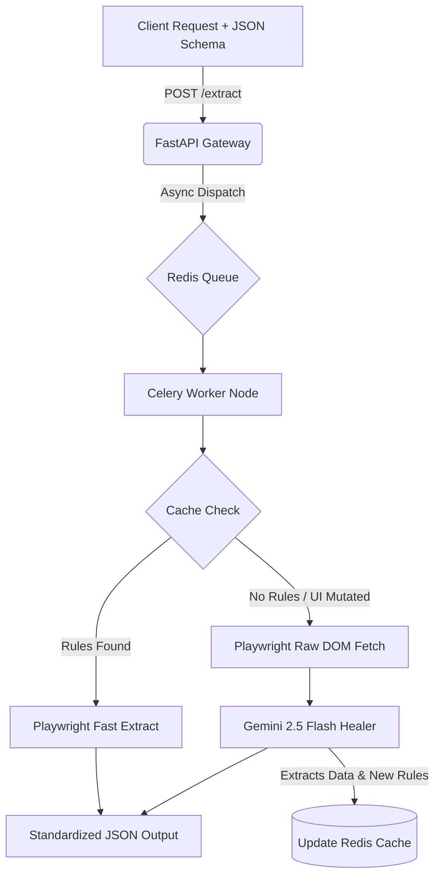

!


# 🕸️ Autonomous Data Refinery (Self-Healing Scraper)
...

### 🕸️ Autonomous Data Refinery (Self-Healing Scraper)

A deterministic, polyglot data ingestion pipeline designed for volatile public web sources.

Standard web scrapers rely on brittle CSS selectors that break the moment a target website updates its UI. This architecture solves the "Day-1" pipeline fragility problem by utilizing an asynchronous, AI-driven self-healing protocol.

## 🏗️ The Architecture

The system prioritizes speed and cost-efficiency using a **Plan-Execute-Verify** loop:
1. **Fast Path ($0 Cost):** The Celery worker checks Redis for cached CSS extraction rules and attempts a high-speed Playwright extraction.
2. **The Healing Path:** If the DOM has mutated and extraction fails, the pipeline routes the raw HTML payload to a Gemini 2.5 Flash microservice.
3. **Deterministic Output:** The LLM is mathematically forced via Google's `google-genai` SDK to extract the requested schema *and* write new Playwright CSS selectors.
4. **System Learning:** The new rules are cached in Redis, allowing subsequent scrapes of that domain to return to the Fast Path.


## 🚀 DevSecOps & Enterprise Standards
* Zero-Trust Secrets: API keys managed via pydantic-settings and securely injected into containers at runtime.

* Strict Guardrails: CI/CD pipeline enforces ruff formatting, mypy strict static typing, and bandit AST security scanning on every commit.

* Bleeding-Edge Inference: Includes experimental support for Google Research's TurboQuant (3-bit KV Cache compression) for local, OOM-resistant HTML processing on consumer hardware.

## 💻 Quick Start (Dockerized)
Configure your environment:
Create a .env file in the root directory:

```Bash
GEMINI_API_KEY=your_api_key_here
Spin up the cluster:
```
```Bash
docker compose up -d --build
```
# Send a dynamic extraction request:

```Bash
curl -X POST http://localhost:8000/extract \
     -H "Content-Type: application/json" \
     -d '{"url": "[https://example.com](https://example.com)", "target_schema": {"main_heading": "string"}}'
```

# Developed with a focus on high-velocity shipping and "zero-fail" manufacturing-honed rigor.
